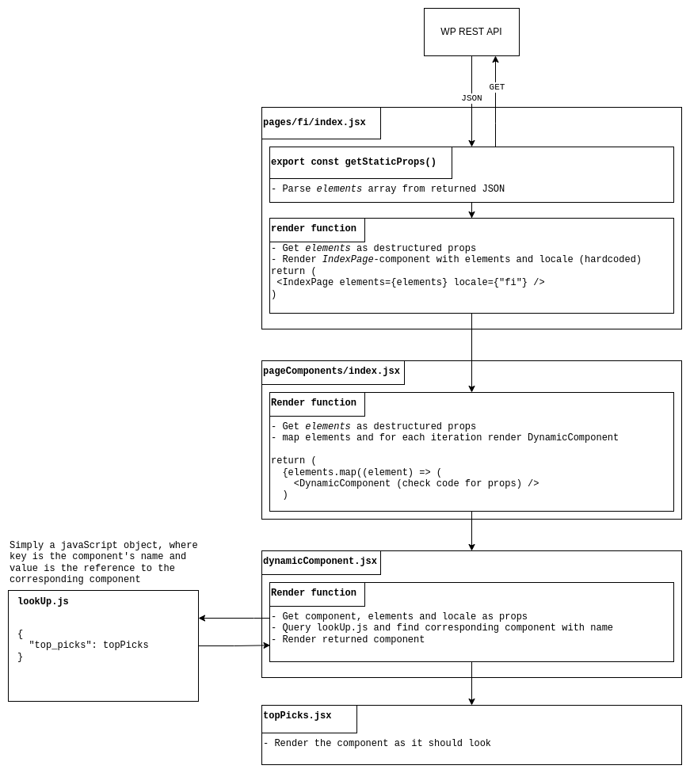

# Elämyskalenteri 
### Running the app:
Make sure you have Node version >= 16
- `npm run dev` runs dev build with hot reload
- `npm run build && npm run start` runs production build

## Configuration
For environment variables you can use the `.env` as a base for `.env.local` file and then set the following variables in the `.env.local` file:

`NEXT_PUBLIC_WP_URL`
 - The URL of the WordPress installation

`NEXT_PUBLIC_EVENTS_COMPONENT_MAIN_URL`
 - The URL of the main.js of the event calendar.


## Data flow explained:


## Building a Docker container:
```
docker build -t elamyskalenteri-nextjs .
```